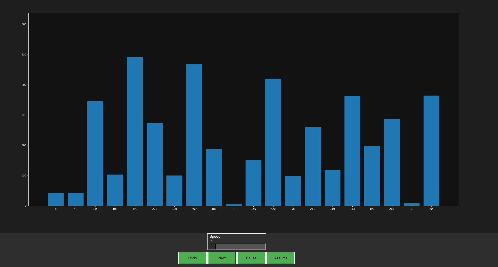
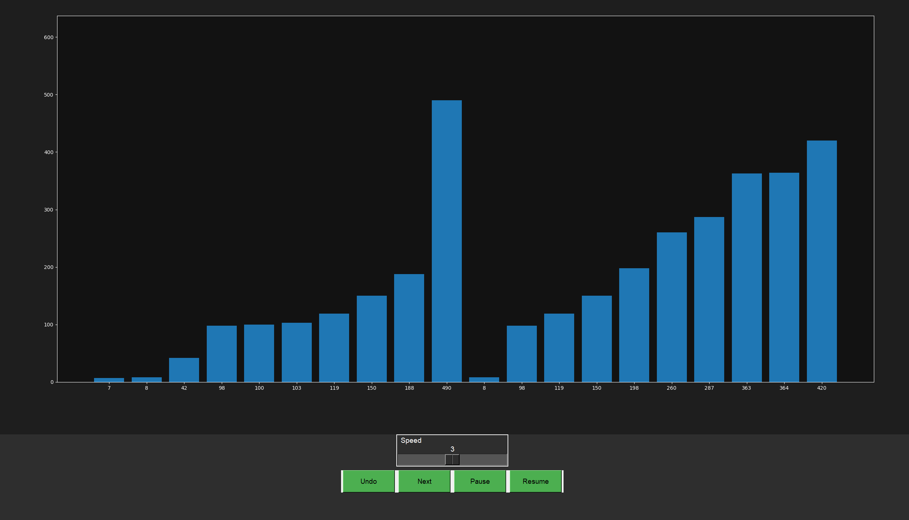

# Sorting Algorithm Visualizer
Sorting Algorithm Visualizers is python program that visualizes various sorting algorithms in action. It provides a graphical representation of how different algorithms sort an array of numbers, making it easier to understand their mechanics and performance.
# Features
- Visualizes various sorting algorithms including Bubble Sort, Selection Sort, Insertion Sort, Merge Sort, Quick Sort, Heap Sort, and more.
- Provides a graphical representation of the sorting process.
- Allows users to input their own data or use random data for visualization.
- supports custom plyaback option to control the speed of the visualization.
- supports many useful features like pause, resume, next and undo.

# Requirements
- Python 3
- Tkinter (for GUI)
- Matplotlib (for plotting)
# Installation
1. Clone the repository:
   ```bash
   git clone https://github.com/U-K-06/Sorting-Algorithm-Visualizer
   ```
2. Navigate to the project directory:
   ```bash
   python app.py
    ```
3. Run the application

# Screenshots and Demo
screenshots and demo videos can be found in the `assets` directory.
[]
[]
[]
